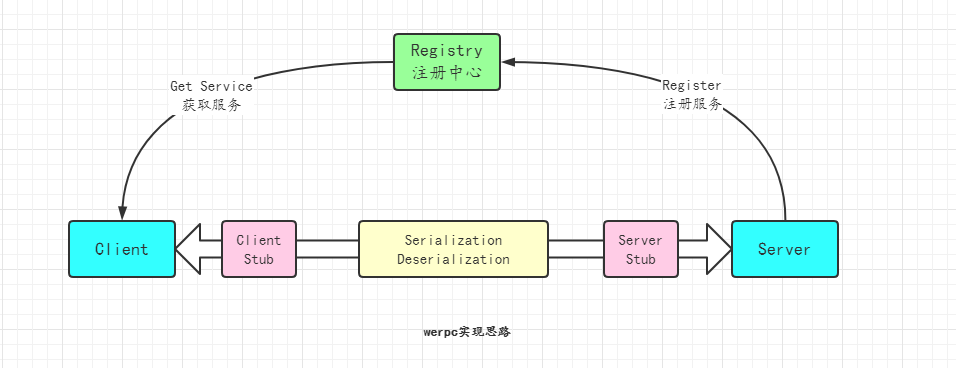

# werpc

## 介绍
A simple rpc framework.

## RPC结构

- **注册中心**  
服务注册与发现，可以使用zookeeper、nacos等作为服务的注册中心，服务端向注册中心注册服务，客户端从服务端发现服务(获取服务信息，如服务器地址等)。
- **服务端**  
提供服务，有服务接口的具体实现，使用反射调用具体实现(stub)
- **客户端**  
获取服务，实现负载均衡策略，调用服务，通过动态代理的方式将网络传输细节封装起来(stub)。
- **序列化与反序列化**  
网络传输必然离不开序列化与反序列化，常见的序列化方式有：XML、JSON、Protobuf、Thrift、hessian、kryo、Avro等  

## 使用

